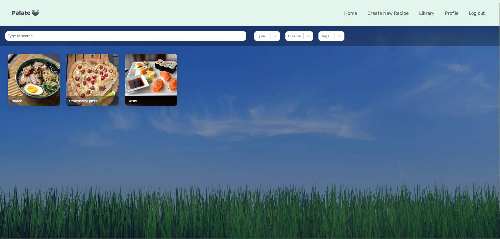

# Palate (a recipe sharing website)
Palate is a MERN-stack web application to share, search and rate recipes.

## Features

- User authentication (signup/login)
- Create, edit, and delete recipes
- Save favorite recipes
- Rate recipes
- Search and filter recipes by type, cuisine, difficulty, and tags
- Image uploads

## Tech Stack

- **Frontend:** React, React Router, react-select  
- **Backend:** Express, Node.js, MongoDB, Mongoose  
- **Deployment:** Render

## Live Demo
You can try the live version of the app here:  
[https://recipe-sharing-website-frontend.onrender.com](https://recipe-sharing-website-frontend.onrender.com)

## Preview

## Possible Planned features
- Following system
- Improved profile page (add bio, profile picture, number of following & followers)
- Ability to create own collections in the library page
- Ability to share recipes

