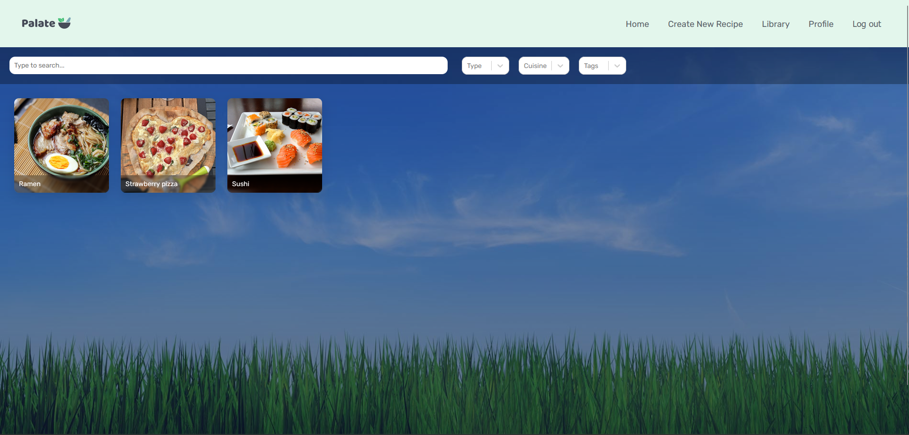

# Palate (a recipe sharing website)
Palate is a MERN-stack web application to share, search and rate recipes.

## Features

- User authentication (signup/login)
- Create, edit, and delete recipes
- Save favorite recipes
- Rate recipes
- Search and filter recipes by type, cuisine, difficulty, and tags
- Image uploads

## Tech Stack

- **Frontend:** React, React Router, react-select  
- **Backend:** Express, Node.js, MongoDB, Mongoose  
- **Deployment:** Render

## Installation

### Prerequisites
- [Node.js](https://nodejs.org/) (v18 or newer recommended)
- A [MongoDB](https://www.mongodb.com/) database

### 1. Clone the repository
```bash
git clone https://github.com/aliisaro/Recipe-Sharing-Website.git
cd Recipe-Sharing-Website
```

### 2. Backend setup
```bash
cd backend
npm install
```

Create a `.env` file inside the `backend` folder with the following variables:
```env
PORT=4000
MONGO_URI=your_mongodb_connection_string
TEST_MONGO_URI=your_test_mongodb_connection_string
SECRET=your_jwt_secret
```
> The frontend expects the API to be available at `http://localhost:4000` by default, so it's recommended to keep `PORT=4000` unless you also set `REACT_APP_API_URL` in the frontend (see below).

Start the backend server:
```bash
npm run dev
```

### 3. Frontend setup
Open a new terminal window:
```bash
cd frontend
npm install
```

Optionally, create a `.env` file inside the `frontend` folder if your backend runs on a different URL than `http://localhost:4000`:
```env
REACT_APP_API_URL=http://localhost:4000
```

Start the frontend:
```bash
npm start
```

The frontend will run on `http://localhost:3000` by default.

### Running tests
From the `backend` folder:
```bash
npm test
```

## Preview

