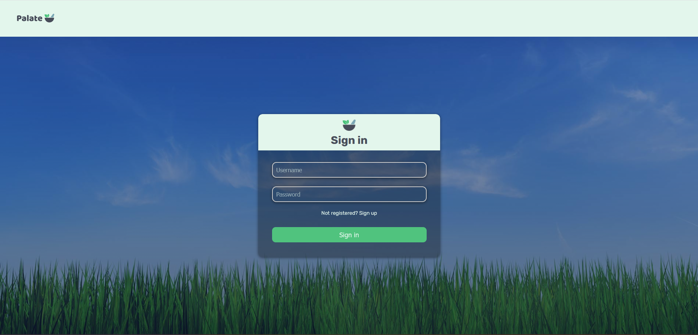
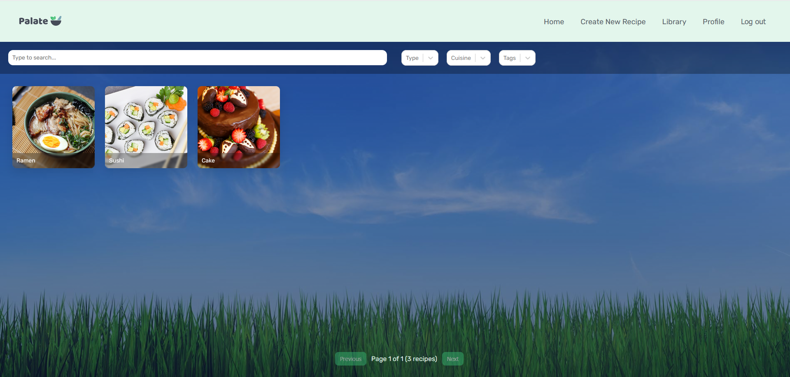
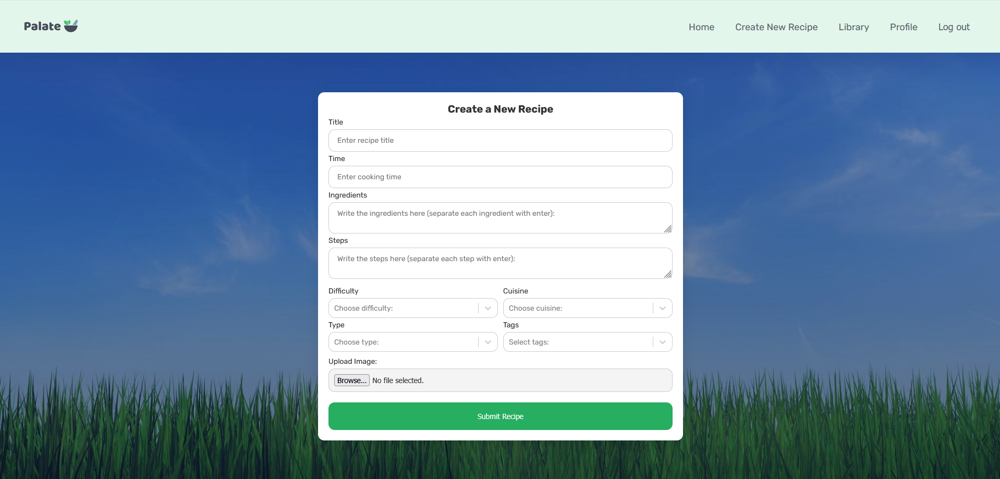

# Palate (a recipe sharing website)

Palate is a MERN-stack web application to share, search and rate recipes.

## Features

- User authentication (signup/login)
- Create, edit, and delete recipes
- Save favourite recipes
- Rate recipes
- Search and filter recipes by type, cuisine, difficulty, and tags
- Image uploads

## Tech Stack

- **Frontend:** React, React Router, react-select
- **Backend:** Express, Node.js, MongoDB, Mongoose

## Installation

### Prerequisites

- [Node.js](https://nodejs.org/)
- A [MongoDB](https://www.mongodb.com/) database

### 1. Clone the repository

```bash
git clone https://github.com/aliisaro/Recipe-Sharing-Website.git
cd Recipe-Sharing-Website
```

### 2. Backend setup

```bash
cd backend
npm install
```

Create a `.env` file inside the `backend` folder with the following variables:

```env
PORT=4000
MONGO_URI=your_mongodb_connection_string
SECRET=your_jwt_secret
```

Start the backend server:

```bash
npm run dev
```

### 3. Frontend setup

Open a new terminal window:

```bash
cd frontend
npm install
npm start
```

The frontend will run on `http://localhost:3000` by default.

## Preview

### Sign in page


### Home page


### Create recipe page

